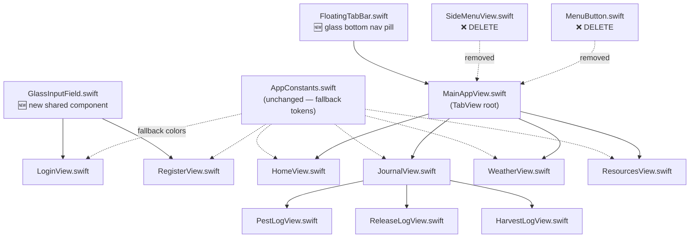
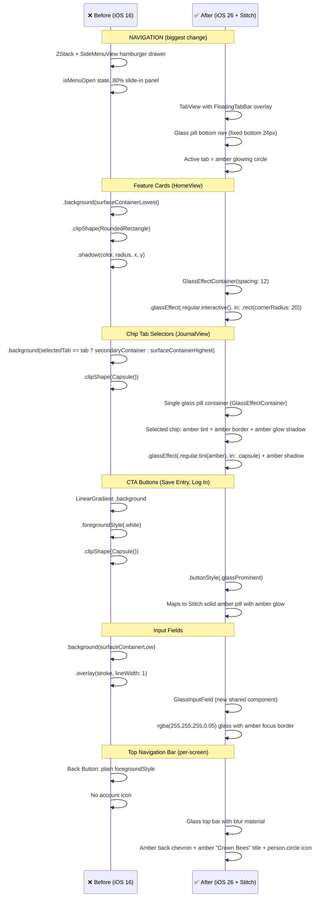
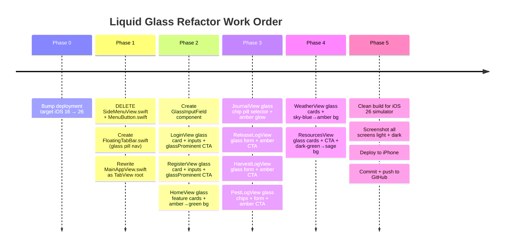

# Liquid Glass Refactor — CrownBees App

## Problem & Approach

The app currently uses manually crafted surfaces (`RoundedRectangle` + `.background` + `.shadow`), opaque `Capsule` chip fills, and a side hamburger drawer. These miss the iOS 26 Liquid Glass aesthetic and the design direction established in the Crown Bees Stitch reference.

The refactor has two tracks:
1. **Navigation architecture**: Replace the hamburger side-drawer with a **floating glass pill bottom tab bar** (Home · Journal · Weather · Resources). This matches the Stitch reference exactly and is the right iOS 26 pattern.
2. **Surface language**: Replace every opaque background + shadow with native Liquid Glass APIs — `glassEffect`, `GlassEffectContainer`, `.buttonStyle(.glass)` / `.glassProminent`.

**Key Stitch reference insights** (from `stitch_crown_bees_liquid_glass_walkthrough.zip`):
- Bottom nav is a floating glass pill (`position: fixed, bottom: 24px`) — **not** a traditional tab bar
- Active tab = solid amber glowing circle (`shadow: 0 0 15px rgba(230,145,0,0.4)`)
- Tab chip selector = one glass pill container with chips inside; selected chip has amber tint + amber border + amber glow
- "Save Entry" = solid amber full-width pill (maps to `.buttonStyle(.glassProminent)`)
- Input fields = very subtle glass `rgba(255,255,255,0.05)` / `rgba(255,255,255,0.1)` border
- Per-screen backgrounds: Journal `#1a3d2a→#4a7c5a`, Weather sky-blue→amber, Resources dark-green→sage, Home amber→forest-green diagonal
- Top bar: glass blur material, amber "Crown Bees" title, account icon on right, back chevron on left

---

## Refactor Phases Overview

```mermaid
flowchart LR
    A["🔧 Phase 0\nDeployment Target\niOS 16 → 26"] --> B

    subgraph B["🧭 Phase 1 — Navigation Architecture\n⚡ BIGGEST CHANGE"]
        B1["MainAppView.swift\nReplace ZStack + drawer\nwith TabView + floating bottom bar"]
        B2["FloatingTabBar.swift 🆕\nGlass pill nav\nHome · Journal · Weather · Resources"]
        B3["SideMenuView.swift ❌\nDelete — replaced by TabView"]
        B4["MenuButton.swift ❌\nDelete — no longer needed"]
    end

    B --> C

    subgraph C["🏠 Phase 2 — Home & Auth"]
        C1[HomeView\nglass feature cards\namber→green gradient bg]
        C2[LoginView\nglass form + glassProminent CTA]
        C3[RegisterView\nglass form + glassProminent CTA]
        C4["GlassInputField.swift 🆕\nshared glass input component"]
    end

    C --> D

    subgraph D["📖 Phase 3 — Journal"]
        D1["JournalView\nglass chip pill selector\nselected = amber glow"]
        D2[ReleaseLogView\nglass form + amber CTA]
        D3[HarvestLogView\nglass form + amber CTA]
        D4["PestLogView\nglass chips + form\nglass CTA"]
    end

    D --> E

    subgraph E["🌤 Phase 4 — Content Screens"]
        E1["WeatherView\nglass cards\nsky-blue→amber gradient"]
        E2["ResourcesView\nglass cards + CTA\ndark-green→sage gradient"]
    end

    E --> F["✅ Phase 5\nBuild + Deploy\nSimulator & iPhone"]
```



---

## File Dependency Map



---

## Component Transformation: Before → After



---

## Work Sequence & Dependencies



---

## Glass API Quick Reference

```mermaid
mindmap
  root((iOS 26\nLiquid Glass APIs))
    Surfaces
      .glassEffect()
        .regular
        .regular.interactive()
        .regular.tint(amberColor)
      GlassEffectContainer
        spacing param controls merge
        wraps ALL sibling glass views
    Buttons
      .buttonStyle(.glass)
        Back button (chevron.left)
        Log Out
        Register link
      .buttonStyle(.glassProminent)
        Log In CTA
        Save Entry (maps to Stitch solid amber pill)
        Visit CrownBees Website
    Shapes
      in .capsule → chips + nav items
      in .rect cornerRadius → cards + forms
      in .rect empty → full panels
    Navigation(Stitch reference)
      FloatingTabBar glass pill
        fixed bottom 24px
        backdrop blur 2xl
        rounded-full w-92pct
      Active tab
        amber circle w-14 h-14
        amber glow shadow
      Inactive tab
        icon + label plain
    Per-Screen Gradients(from Stitch)
      Home
        amber top → forest green bottom
      Journal
        1a3d2a → 4a7c5a forest green
      Weather
        sky blue → amber
      Resources
        dark green → sage
    Rules
      glassEffect AFTER layout modifiers
      vivid gradient background required
      GlassEffectContainer wraps ALL siblings
      Remove manual background + shadow
      No hamburger drawer — bottom TabView only
```

---

## Human Plan (What changes, why)

| Area | Current | After |
|---|---|---|
| **⚡ Navigation (BIG CHANGE)** | ZStack + SideMenuView hamburger drawer | `TabView` with a custom `FloatingTabBar` glass pill overlay |
| **Bottom tab bar** | Side drawer with 4 nav items | Floating glass pill (Home · Journal · Weather · Resources) at bottom, active = amber glowing circle |
| **MenuButton + SideMenuView** | Kept; hamburger → slide-in panel | **Deleted** — no longer needed with bottom tab bar |
| **Deployment target** | iOS 16 | iOS 26 (minimum for native LG) |
| **Feature cards (HomeView)** | Opaque rounded rect + shadow | `.glassEffect(.regular.interactive(), in: .rect(...))` inside `GlassEffectContainer`; amber→green gradient bg |
| **Journal tab chips (JournalView)** | Opaque capsule fill | Single glass pill container; selected chip = amber tint + amber glow shadow |
| **Pest/Release/Harvest form chips** | Opaque capsule fill | Same GlassEffectContainer amber-glow pattern |
| **Save Entry / CTA buttons** | Gradient capsule | `.buttonStyle(.glassProminent)` — maps to Stitch solid amber pill |
| **Login / Register form card** | Opaque `surfaceContainerLowest` card | `.glassEffect(in: .rect(cornerRadius: 16))` over hero gradient |
| **Log In / Register CTA** | Gradient capsule | `.buttonStyle(.glassProminent)` |
| **Weather cards** | Opaque rounded rect + shadow | `.glassEffect(in: .rect(cornerRadius: 16))`; sky-blue→amber gradient bg |
| **Resource cards** | Opaque rounded rect + shadow | `.glassEffect(.regular.interactive(), in: .rect(cornerRadius: 12))`; dark-green→sage bg |
| **Input fields** | `surfaceContainerLow` bg + stroke | `GlassInputField`: `rgba(255,255,255,0.05)` glass, amber focus border |
| **Top nav bar (per screen)** | Plain back button, no account icon | Glass blur top bar: amber back chevron + amber "Crown Bees" title + person.circle icon |
| **AppConstants surfaces** | Hardcoded surface fills | Kept as pre-iOS-26 fallback; not used on glass surfaces |

**What is NOT changed:** All business logic, models, services, URL constants, color assets, `@Binding`/`@State` wiring, `AppScreen` enum (repurposed as TabView tabs).

---

## Agent Plan (Execution)

### 0. Pre-flight: Bump deployment target to iOS 26

**File:** `CrownBeesApp.xcodeproj/project.pbxproj`
- All three occurrences of `IPHONEOS_DEPLOYMENT_TARGET = 16.0;` → `IPHONEOS_DEPLOYMENT_TARGET = 26.0;`
- Use `sed` in bash.

**Why:** `glassEffect`, `GlassEffectContainer`, `.buttonStyle(.glass)` are iOS 26 APIs.

---

### 1. Navigation Architecture — FloatingTabBar + MainAppView rewrite
**⚡ Biggest structural change in this refactor.**

#### 1a. Delete obsolete files
- Delete `CrownBeesApp/Views/Components/SideMenuView.swift`
- Delete `CrownBeesApp/Views/Components/MenuButton.swift`

#### 1b. Create `FloatingTabBar.swift`
**New file:** `CrownBeesApp/Views/Components/FloatingTabBar.swift`

This is a custom floating glass pill tab bar inspired by the Stitch reference:
- Floating glass pill (`position: overlay, bottom: 16px equivalent`)
- Contains 4 tab items: Home, Journal, Weather, Resources
- Active tab item = amber filled circle (`AppConstants.primary` tint) with amber glow shadow
- Inactive tab = icon + small label, plain glass (no fill)
- The whole pill uses `.glassEffect(in: .capsule)` with `GlassEffectContainer`

```swift
// FloatingTabBar.swift sketch:
struct FloatingTabBar: View {
    @Binding var selection: AppTab

    var body: some View {
        HStack(spacing: 0) {
            ForEach(AppTab.allCases) { tab in
                tabItem(tab)
            }
        }
        .padding(.horizontal, 8)
        .padding(.vertical, 8)
        .glassEffect(in: .capsule)
        .padding(.horizontal, 20)
        .shadow(color: .black.opacity(0.15), radius: 20, y: 8)
    }

    private func tabItem(_ tab: AppTab) -> some View {
        Button {
            selection = tab
        } label: {
            VStack(spacing: 3) {
                Image(systemName: tab.icon)
                    .font(.system(size: selection == tab ? 22 : 20, weight: .medium))
                Text(tab.label)
                    .font(.system(size: 10, weight: .medium))
            }
            .frame(maxWidth: .infinity)
            .foregroundStyle(selection == tab ? AppConstants.primary : .secondary)
            .padding(.vertical, 6)
            .background {
                if selection == tab {
                    Circle()
                        .fill(AppConstants.primary.opacity(0.15))
                        .shadow(color: AppConstants.primary.opacity(0.4), radius: 8)
                }
            }
        }
        .buttonStyle(.plain)
    }
}

enum AppTab: String, CaseIterable, Identifiable {
    case home, journal, weather, resources
    var id: String { rawValue }
    var label: String { rawValue.capitalized }
    var icon: String {
        switch self {
        case .home: "house.fill"
        case .journal: "book.fill"
        case .weather: "cloud.sun.fill"
        case .resources: "link"
        }
    }
}
```

#### 1c. Rewrite `MainAppView.swift`
**Path:** `CrownBeesApp/Views/Components/MainAppView.swift`

Replace the current ZStack + `isMenuOpen` + `SideMenuView` pattern entirely with:
```swift
// MainAppView.swift — new structure
struct MainAppView: View {
    @State private var selectedTab: AppTab = .home
    @State private var navigationPath = NavigationPath()

    var body: some View {
        ZStack(alignment: .bottom) {
            TabView(selection: $selectedTab) {
                HomeView()
                    .tag(AppTab.home)
                JournalView()
                    .tag(AppTab.journal)
                WeatherView()
                    .tag(AppTab.weather)
                ResourcesView()
                    .tag(AppTab.resources)
            }
            .tabViewStyle(.page(indexDisplayMode: .never))
            // OR use standard TabView but hide default tab bar:
            // .toolbar(.hidden, for: .tabBar)

            FloatingTabBar(selection: $selectedTab)
                .padding(.bottom, 16)
        }
        .ignoresSafeArea(edges: .bottom)
    }
}
```
Remove: `AppScreen` enum, `isMenuOpen` state, all `SideMenuView` references, `MenuButton` references, `backButton` logic (each subview now owns its back navigation via `NavigationStack`).

**Note:** Each tab view (HomeView, JournalView, etc.) should wrap its content in a `NavigationStack` if deep navigation is needed within that tab.

---

### 2. HomeView.swift
**Path:** `CrownBeesApp/Views/Home/HomeView.swift`

**Background:** Replace existing background with amber→forest-green gradient:
```swift
.background(
    LinearGradient(
        colors: [AppConstants.primary.opacity(0.7), AppConstants.secondary],
        startPoint: .topLeading, endPoint: .bottomTrailing
    ).ignoresSafeArea()
)
```

**featureCard helper (lines 87–119):**
- Remove `.background(AppConstants.surfaceContainerLowest).clipShape(...).shadow(...)`.
- Replace with `.glassEffect(.regular.interactive(), in: .rect(cornerRadius: AppConstants.Radius.lg))`.

Wrap all three `featureCard` calls in a `GlassEffectContainer(spacing: 12)`.

**Hero gradient:** Keep as-is — it's the vivid backdrop that makes glass look great.

---

### 3. JournalView.swift
**Path:** `CrownBeesApp/Views/Journal/JournalView.swift`

**chipButton helper (lines 52–66):**
- Remove `.background(...).clipShape(Capsule())`.
- Selected state: `.glassEffect(.regular.tint(AppConstants.secondary).interactive(), in: .capsule)` **plus** amber glow shadow: `.shadow(color: AppConstants.primary.opacity(0.35), radius: 8)`
- Inactive state: `.glassEffect(.regular.interactive(), in: .capsule)` no shadow

Wrap the `HStack` of chips (lines 27–31) in a single `GlassEffectContainer(spacing: 8)`.

**Tab strip background (line 35):** Remove `.background(AppConstants.surfaceContainerLow)` — glass handles visual separation.

**Page background:** Forest green gradient matching Stitch reference:
```swift
.background(
    LinearGradient(
        stops: [
            .init(color: Color(hex: "#1a3d2a"), location: 0),
            .init(color: Color(hex: "#4a7c5a"), location: 1)
        ],
        startPoint: .top, endPoint: .bottom
    ).ignoresSafeArea()
)
```

---

### 4. PestLogView.swift, ReleaseLogView.swift, HarvestLogView.swift
**Path:** `CrownBeesApp/Views/Journal/[Pest|Release|Harvest]LogView.swift`

**Form card container** (the `VStack` with `.background(AppConstants.surfaceContainerLowest).clipShape(...).shadow(...)`):
- Remove `.background`, `.clipShape`, `.shadow`.
- Add `.glassEffect(in: .rect(cornerRadius: AppConstants.Radius.lg))`.

**Chip selectors** (pest type, severity — same pattern as JournalView above):
- Wrap each chip `HStack`/`ScrollView HStack` in `GlassEffectContainer(spacing: 8)`.
- Each chip: remove opaque background/clip, apply `.glassEffect(.regular.tint(...).interactive(), in: .capsule)`.

**Save Entry button:**
- Remove gradient `.background`, `.clipShape(Capsule())`, `.foregroundStyle(.white)`.
- Replace entire button content with `.buttonStyle(.glassProminent)`.

**Past Entries card** (the second `VStack` with `.background(AppConstants.surfaceContainerLowest).clipShape(...).shadow(...)`):
- Same card treatment: remove manual bg/clip/shadow, add `.glassEffect(in: .rect(cornerRadius: AppConstants.Radius.lg))`.

---

### 5. WeatherView.swift
**Path:** `CrownBeesApp/Views/Weather/WeatherView.swift`

WeatherView uses computed view properties (`locationBar`, `daveAdvisoryCard`, `currentConditionsCard`, `beeActivityBanner`, `forecastCard`). Read lines 50–400 before editing.

**Card surfaces:** Any `VStack`/`HStack` with `.background(AppConstants.surfaceContainerLowest).clipShape(RoundedRectangle...).shadow(...)`:
- Remove bg/clip/shadow, add `.glassEffect(in: .rect(cornerRadius: AppConstants.Radius.lg))`.

**Background:** Replace `.background(AppConstants.beige.ignoresSafeArea())` with sky-blue→amber gradient (Stitch reference):
```swift
.background(
    LinearGradient(
        colors: [Color(hex: "#87CEEB").opacity(0.8), AppConstants.primary.opacity(0.6)],
        startPoint: .top, endPoint: .bottom
    ).ignoresSafeArea()
)
```

**Search/location bar:** If it has a background, replace with `.glassEffect(.regular.interactive(), in: .capsule)`.

---

### 6. ResourcesView.swift
**Path:** `CrownBeesApp/Views/Resources/ResourcesView.swift`

**Quick Links card container** (lines 103–106, the outer `VStack` with `.background(AppConstants.surfaceContainerLowest).clipShape(...).shadow(...)`):
- Remove manual bg/clip/shadow, add `.glassEffect(in: .rect(cornerRadius: AppConstants.Radius.lg))`.

**resourceCard helper:** Each individual card row `VStack`:
- Remove `.background(AppConstants.surfaceContainerLow).clipShape(RoundedRectangle...)`.
- Add `.glassEffect(.regular.interactive(), in: .rect(cornerRadius: AppConstants.Radius.md))`.

Wrap the three `resourceCard` calls in `GlassEffectContainer(spacing: 8)`.

**"Visit CrownBees Website" button:**
- Remove gradient `.background`, `.clipShape(Capsule())`.
- Replace with `.buttonStyle(.glassProminent)`.

**Background:** Replace `.background(AppConstants.surface.ignoresSafeArea())` with dark-green→sage gradient matching Stitch reference:
```swift
.background(
    LinearGradient(
        colors: [AppConstants.secondary.opacity(0.5), Color(hex: "#6ba17a").opacity(0.3)],
        startPoint: .top, endPoint: .bottom
    ).ignoresSafeArea()
)
```

---

### 7. LoginView.swift & RegisterView.swift
**Path:** `CrownBeesApp/Views/Auth/LoginView.swift`, `RegisterView.swift`

**Form card** (the `VStack` at line 53 with `.background(AppConstants.surfaceContainerLowest).clipShape(...).shadow(...)`, line 100–102):
- Remove manual bg/clip/shadow.
- Add `.glassEffect(in: .rect(cornerRadius: AppConstants.Radius.lg))`.

**Input fields** (`ghostField` / `ghostSecureField` helpers, lines 114–135):
- Remove `.background(AppConstants.surfaceContainerLow).clipShape(...).overlay(stroke...)`.
- Replace with `.glassEffect(.regular.interactive(), in: .rect(cornerRadius: AppConstants.Radius.md))`.

**Log In / Register CTA button** (lines 70–84):
- Remove gradient `.background`, `.clipShape(Capsule())`.
- Replace with `.buttonStyle(.glassProminent)`.

**Register link button:** Add `.buttonStyle(.glass)`.

**Hero:** Keep amber gradient — glass will refract it beautifully behind the form card.

---

## View Refactor Notes (per swiftui-view-refactor skill)

Apply these structural improvements alongside the glass changes:

- **WeatherView** (>300 lines): Already uses computed view properties correctly — verify `// MARK: -` sections exist and add if missing.
- **PestLogView / ReleaseLogView / HarvestLogView**: Extract the entry form `VStack` into a `private var entryForm: some View` computed property and the past entries into `private var pastEntriesSection: some View` for cleaner `body`.
- **LoginView / RegisterView**: Move `ghostField` / `ghostSecureField` into a shared `GlassInputField` view in `Components/` to eliminate duplication.
- **SideMenuView**: Move `menuItem(title:icon:screen:)` to a `private struct SideMenuItem: View` — it carries enough state to warrant extraction.
- **All `@StateObject`**: WeatherView uses `@StateObject private var service = WeatherService()` — this is fine for now (service is a reference type). Flag for future migration to `@Observable` pattern.

---

## Build & Verification Steps

```bash
# 1. Clean build after deployment target bump
xcodebuild -project CrownBeesApp.xcodeproj -scheme CrownBeesApp \
  -configuration Debug \
  -destination 'id=8499F6FB-5BF5-457E-A391-BB679FB9070A' \
  -allowProvisioningUpdates clean build

# 2. Install and launch on simulator
xcrun simctl install 8499F6FB-5BF5-457E-A391-BB679FB9070A <app_path>
xcrun simctl launch 8499F6FB-5BF5-457E-A391-BB679FB9070A com.crownbees.CrownBeesApp

# 3. Screenshot check list (take screenshot after each screen):
#    - Home (glass feature cards + hero gradient)
#    - Side menu open (glass panel)
#    - Journal + Pest tab (glass chips)
#    - Weather (glass cards)
#    - Resources (glass cards + CTA)
#    - Login (glass form over gradient hero)

# 4. Dark mode check
xcrun simctl ui <sim_id> appearance dark
# Repeat screenshots — glass should look great in both modes

# 5. Deploy to iPhone
xcodebuild ... -destination 'id=00008120-001159E610A14932' build
xcrun devicectl device install app ...
xcrun devicectl device process launch ...
```

---

## Files Modified

| File | Change type |
|---|---|
| `CrownBeesApp.xcodeproj/project.pbxproj` | Bump deployment target iOS 16 → 26 |
| `Views/Components/MainAppView.swift` | **Rewrite** — TabView root + FloatingTabBar overlay |
| `Views/Components/SideMenuView.swift` | **DELETE** — replaced by FloatingTabBar |
| `Views/Components/MenuButton.swift` | **DELETE** — no longer needed |
| `Views/Home/HomeView.swift` | Glass feature cards + `GlassEffectContainer` + amber→green bg |
| `Views/Journal/JournalView.swift` | Glass chips + amber glow on selected + forest green bg |
| `Views/Journal/PestLogView.swift` | Glass form card, glass chips, glassProminent CTA |
| `Views/Journal/ReleaseLogView.swift` | Glass form card, glassProminent CTA |
| `Views/Journal/HarvestLogView.swift` | Glass form card, glassProminent CTA |
| `Views/Weather/WeatherView.swift` | Glass cards + sky-blue→amber bg |
| `Views/Resources/ResourcesView.swift` | Glass cards + `GlassEffectContainer` + dark-green→sage bg |
| `Views/Auth/LoginView.swift` | Glass form card, glass inputs, glassProminent CTA |
| `Views/Auth/RegisterView.swift` | Same as LoginView |

**New files:**
| File | Purpose |
|---|---|
| `Views/Components/FloatingTabBar.swift` | Floating glass pill bottom navigation (4 tabs, amber active circle) |
| `Views/Components/GlassInputField.swift` | Shared glass input field replacing `ghostField`/`ghostSecureField` duplication |

---

## Gotchas

- **Navigation architecture change**: The biggest risk is removing `isMenuOpen`, `AppScreen` enum, and `SideMenuView` all at once. Do Phase 1 first, verify build, then proceed. The `AppTab` enum replaces `AppScreen`.
- `GlassEffectContainer` must wrap ALL sibling glass views that should interact/merge — don't apply it to just one chip. The container's `spacing:` param controls merge distance, not visual spacing (keep layout `spacing` separate).
- `.glassEffect()` must come **after** all layout/appearance modifiers (`.padding`, `.frame`, `.foregroundStyle`) — wrong order produces clipping artifacts.
- `.buttonStyle(.glassProminent)` overrides the button label's foreground color — remove manual `.foregroundStyle(.white)` from the label to avoid double-application.
- Simulator must be running iOS 26 to preview glass. The iPhone must be on iOS 26 beta.
- WeatherView uses `.background(AppConstants.beige.ignoresSafeArea())` — this opaque cream background must be replaced with a gradient or glass looks like frosted plastic.
- The existing `SecondaryLightGreen` dark mode fix from last session still applies — `.tint(AppConstants.secondary)` on the glass chip will use the adaptive color correctly.
- `Color(hex:)` extension: Add a `Color+Hex.swift` extension if not already present — needed for `#1a3d2a`, `#4a7c5a`, `#87CEEB`, `#6ba17a` gradient stops.
- `TabView` with `.page` style may need `.tabViewStyle(.automatic)` with hidden default tab bar — verify the right approach for iOS 26 TabView + custom floating nav.
- The `FloatingTabBar` must have `safeAreaInset(edge: .bottom)` padding on the content views so content doesn't disappear behind the floating pill.
